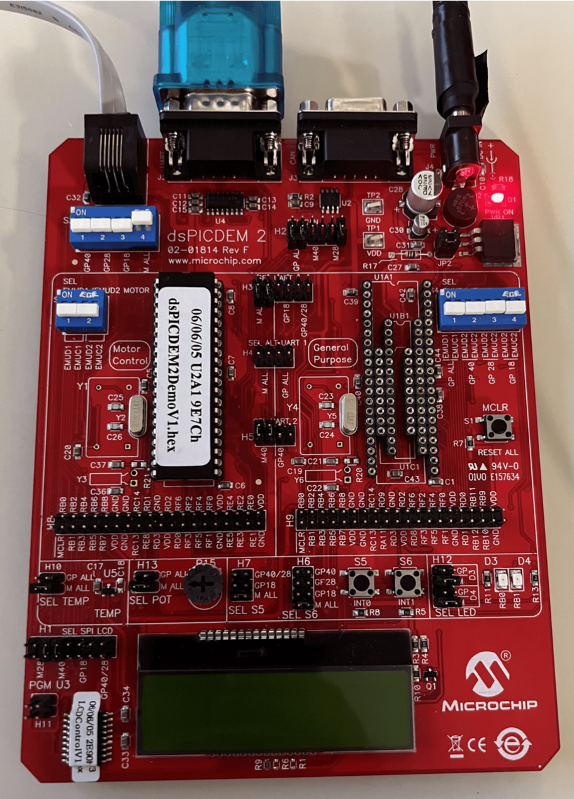

[Embedded System](https://corsi.unige.it/en/off.f/2022/ins/59432?codcla=10635)<br>
**Author:** [Ankur Kohli](https://github.com/ankurkohli007), [Ammar Iqbal](https://github.com/ammariqbal48) & [Basit Akram](https://github.com/abdulbasit656)<br>
[M.Sc Robotics Engineering](https://corsi.unige.it/corsi/10635)<br>
[University of Genoa (UniGe)](https://unige.it/en)<br>
**Supervisor:** [Prof. Enrico Simetti](https://rubrica.unige.it/personale/UkNGW15g)

## Abstract ##

This assignemnt report is about the **Embedded Systems** in which the of ***timers, interrupts, SPI, UART,*** and so on to determine about the operations performance. The specific goal in this case is that to know the implementation of operations with the real-time hardware. This report to bring the light on Embedded Systems for operations. Furthermore, the purpose of this report is to provide the approaches used during the development of code and implementation on microcontroller board. For this assignment, ***MPLAB IDE Software, XC16 Compiler and Microchip Microcontroller Board, HTerm serial software*** is used and also ***Embedded C programming*** is platform for the development of code.

## Introduction ##

A microprocessor-based computer system with software that is intended to carry out a specific task, either independently or as a component of a larger system, is known as an embedded sys- tem. An integrated circuit built to perform computing for real-time processes is at the heart of the system. 

From a single microcontroller to a group of connected processors with networks and peripherals, complexity can range from having no user interface to having intricate graphical user interfaces. Depending on the task for which it is created, an embedded system’s complexity varies greatly. 

Applications for embedded systems include hybrid cars, avionics, digital watches, microwaves, and more. Embedded systems consume up to 98 percent of all produced microprocessors.

## Requirements for the Assignment ##

* Simulate an algorithm that needs 7 ms for its execution, and needs to work at 100 Hz.
* Read characters from UART and display the characters received on the first row of the LCD.
* When the end of the row has been reached, clear the first row and start writing again from the first row first column.
* Whenever a CR ’\r’ or LF ’\n’ character is received, clear the first row.
* On the second row, write "Char Recv: XXX", where XXX is the number of characters received from the UART2. (use sprintf(buffer, “%d”, value) to convert an integer to a string to be displayed.
* Whenever button S5 is pressed, send the current number of chars received to UART2.
* Whenever button S6 is pressed, clear the first row and reset the characters received counter.

## Tips for Writing to LCD with SPI

The following power-up sequence should be observed by the user’s application firmware when writing characters to the LCD:

* After any reset operation wait 1000 milliseconds to allow the LCD to begin normal opera- tion. The cursor on the LCD will be positioned at the top row on the left-most column.
* Configure SPI1 module on your dsPIC30F device to operate in 8-bit Master mode. The serial clock may be set for any frequency up to 1 MHz.
* To write an ASCII character to the LCD at the location pointed to by the cursor, load the SPIBUF register with the ASCII character byte.
* After the character is displayed on the LCD, the cursor is automatically relocated to the next position on the LCD.
* To reposition the cursor to another column on any of the two rows, write the address of the desired location to the SPIBUF register. Addresses in the first row of the LCD range from 0x80 to 0x8F, while addresses on the second row range from 0xC0 through 0xCF.
* After 16 characters are written to the first row on the LCD, it is necessary for the user’s application to write the address 0xC0 of the second row to the SPIBUF in order to roll the cursor over to the second row.
* The user application must wait for a minimum of (8 bits / SPI Frequency) between writing two successive characters or addresses.

## Algorithm used for the accomplishment of the goal of the assignment ##

```c
void algorithm() 
{
tmr wait ms(TIMER2, 7);

    }
int main()
{
tmr setup period(TIMER1, 10); while(1)
{
algorithm() ;
// code to handle the assignment tmr wait period(TIMER1);
}
}
```

## Hardware used for the assignment ## 

***dsPIC30F4011 Enhanced Flash 16-bit Digital Signal Microcontroller Board*** is used for the assignment. Figure below shows microcontroller board used. 



**Peripheral Features of the dsPIC30F4011 Microcontroller Board:**

* High current sink/source I/O pins: 25 mA/25 mA
*Timer module with programmable prescaler: Five 16-bit timers/counters; optionally pair 16-bit timers into 32-bit timer modules
*16-bit Capture input functions
* 16-bit Compare/PWM output functions
* 3-wire SPITM modules (supports 4 Frame modes)
* I2CTM module supports Multi-Master/Slave mode and 7-bit/10-bit addressing
*  2 UART modules with FIFO Buffers
* 1 CAN modules, 2.0B compliant


